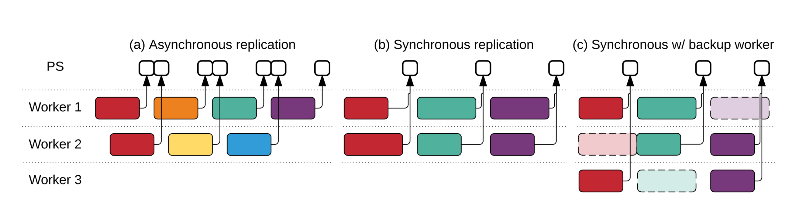

- [Tensorflow](#tensorflow)
    - [介绍](#%E4%BB%8B%E7%BB%8D)
        - [DAG特点](#dag%E7%89%B9%E7%82%B9)
    - [背景&动机](#%E8%83%8C%E6%99%AF%E5%8A%A8%E6%9C%BA)
        - [早期系统 DistBelief](#%E6%97%A9%E6%9C%9F%E7%B3%BB%E7%BB%9F-distbelief)
            - [特点](#%E7%89%B9%E7%82%B9)
            - [问题](#%E9%97%AE%E9%A2%98)
        - [设计原则](#%E8%AE%BE%E8%AE%A1%E5%8E%9F%E5%88%99)
            - [具体措施](#%E5%85%B7%E4%BD%93%E6%8E%AA%E6%96%BD)
    - [理念](#%E7%90%86%E5%BF%B5)
    - [执行模型 - 抽象](#%E6%89%A7%E8%A1%8C%E6%A8%A1%E5%9E%8B---%E6%8A%BD%E8%B1%A1)
        - [基本元素](#%E5%9F%BA%E6%9C%AC%E5%85%83%E7%B4%A0)
        - [部分与并发执行](#%E9%83%A8%E5%88%86%E4%B8%8E%E5%B9%B6%E5%8F%91%E6%89%A7%E8%A1%8C)
        - [分布式执行 - 节点放置](#%E5%88%86%E5%B8%83%E5%BC%8F%E6%89%A7%E8%A1%8C---%E8%8A%82%E7%82%B9%E6%94%BE%E7%BD%AE)
        - [节点通信 - 去中心化的send-recv](#%E8%8A%82%E7%82%B9%E9%80%9A%E4%BF%A1---%E5%8E%BB%E4%B8%AD%E5%BF%83%E5%8C%96%E7%9A%84send-recv)
        - [动态控制流](#%E5%8A%A8%E6%80%81%E6%8E%A7%E5%88%B6%E6%B5%81)
        - [容错](#%E5%AE%B9%E9%94%99)
    - [扩展优化](#%E6%89%A9%E5%B1%95%E4%BC%98%E5%8C%96)
        - [微分优化](#%E5%BE%AE%E5%88%86%E4%BC%98%E5%8C%96)
        - [处理大模型](#%E5%A4%84%E7%90%86%E5%A4%A7%E6%A8%A1%E5%9E%8B)
        - [同步协调方式](#%E5%90%8C%E6%AD%A5%E5%8D%8F%E8%B0%83%E6%96%B9%E5%BC%8F)
    - [举例说明](#%E4%B8%BE%E4%BE%8B%E8%AF%B4%E6%98%8E)
- [附： 新的分布式联合机器学习](#%E9%99%84%EF%BC%9A-%E6%96%B0%E7%9A%84%E5%88%86%E5%B8%83%E5%BC%8F%E8%81%94%E5%90%88%E6%9C%BA%E5%99%A8%E5%AD%A6%E4%B9%A0)
- [ppt](#ppt)
- [demo](#demo)
    - [参考](#%E5%8F%82%E8%80%83)

## Tensorflow
这是还未完善的版本。。。

### 介绍
- 处理背景：
       - 机器学习盛行
       - 训练数据增多
       - 网络巨大
- 抽象 ： 所有就算在一个数据流图中
- 物理： 集群中的CPU，GPU，ASIC(TPU)
- 描述如果合理使用分布式环境下的计算资源去根据 tensorflow 数据流模型完成计算
- 目的： large-scale and genral interface

#### DAG特点
- parameter updates 一致性要求低
- 每个worker可以独立更新

### 背景&动机
#### 早期系统 DistBelief

##### 特点
基于parameter server（用一些服务器管理共享状态）架构，2011年开始在google内使用的
- stateless worker 处理计算，并且独立更新变动值到parameter server
    - 读取数据和模型
    - 训练时计算损失函数和模型梯度
    - 将梯度送还给
- stateful parameter server 维护模型参数 // 雷同caffe
##### 问题
- Refining the training algorithms 就是原来的接口不够用，比如`原子性更新`、或者把计算转移到服务端`降低网络开销`
- Defining new training algorithms 对某些模型不适用，比如RNN(有环),强化学习(损失函数要在别的地方计算)，更别说一些其他不基于神经元网络的机器学习模型了，比如随机森林。为了`适用多模型`  
> TODO: 提交改动的更新规则过于单一？
- Single programming model and runtime system for all of these environments 太重了，不够`flexible` 对于不同平台尤其scale down需要重新定制，

TODO RNN的模型咋更新的

#### 设计原则
- flexible : 对于环境
- friendly:  simple dataflow-based pro- gramming abstraction
##### 具体措施
- Dataflow graphs of primitive operators 新的抽象接口提供各种更新策略
- Deferred execution:  TODO 这个优化怎么作的
- Common abstraction for heterogeneous accelerators， GPU,TPU,CPU,M-CPU,甚至RDMA加快内存传输
- task啥的 TODO 没看懂

### 理念
- 结合 数据流， 和 parameter servers

### 执行模型 - 抽象

#### 基本元素
- 张量(Tensors): 表示计算中的所有数据，其都是`密集`的
        - TODO 密集方便了底层存储分配和串行化？
- 算子(operation):  顶点的计算。编译时确定，以m≥0张量作为输入，n≥0张量作为输出。 可以当成一次运算，规定了输入输出类型。

- 变量(variables, Stateful operations） 就是训练模型的共享参数w
- 队列(queues, Stateful operations) : 就是维护数据的队列

#### 部分与并发执行
- 目的：灵活
- 允许执行子图部分执行，这样灵活了

> 这章跟分布式也没什么关系，是特性的上的介绍。

#### 分布式执行 - 节点放置
- 如何将task分配到指定的设备，即data graph 映射到设备。
   - 约束： 状态操作和操作他们的状态必须在同一个设备上，这导致的隐式的共置约束。
   - 允许客户端设置限制

TODO可以不可以自动，目前看来不特别智能,主要是用户指定的。原本的分布式相对比较基本。这个问题还有待研究。
> 采用了一种模拟执行过程的启发式的cost model，即先模拟一遍图的执行过程，采用启发式贪心策略来分配。首先设备需要满足能够执行该node所需的操作，然后再谈分配的问题，在备选的设备中选取一个预计执行时间最小的设备，放置，然后进行下面的分配，当然在有控制依赖的时候还需要加以考虑。

#### 节点通信 - 去中心化的send-recv

master只需要提出“任务”(通过Run)给workers，而无需管理workers之间的通信

#### 动态控制流
虽然大部分情况图是没有分支的，这边是支持两个switch和merge算子去做条件切换。甚至为了表达更多机器学习框架，比如有选择性的那个会自动删边的模型，还有更多别的论文提到的Enter，Leave，NextIteration表达控制流的原语。

> 这章跟分布式也没什么关系，是特性的上的介绍。

#### 容错
不需要强一致性。
定时checkpoint机制，甚至做检查点时候也不需要阻塞，即时一般是更新的，一般是不更新的也无所谓。
失败恢复的一致性不用特别去保证。

训练状态不使用强一致性，但依靠一个像Chubby或ZooKeeper系统，将任务ID映射到IP地址上。 只是中心节点了解某个task是否完成，然后决定是否重做。

### 扩展优化
本质目的是 增加资源利用率。
#### 微分优化 
跟分布式
#### 处理大模型
就是把图切分到不同设备。
#### 同步协调方式
三种方式可配置

1、在异步情况下（图4（a）），每个工作者在步骤开始时读取当前值，并将其梯度最终应用于不同的当前值：确保了高利用率，但是各个步骤使用旧信息，不是很有效。

2、同步情况使用队列协调执行：阻塞队列作为一个障碍，以确保所有工作者读取相同的参数版本，第二个队列累积多个梯度更新，为了以原子方式应用它们。 简单的同步版本（图4（b））在应用它们之前累积所有工作者的更新，但是慢工作者限制总吞吐量。

3、为了缓解落后者，实现了备份工作（图4（c）），这与MapReduce备份任务类似。 而MapReduce被动启动备份任务 - 在检测到落后者之后 - 我们的备份工作者主动运行，并且聚集将采用n个更新中的前m个。 利用SGD的随机抽取训练数据，每个工作者可处理不同的随机批次。 吞吐量提高到15％。

### 举例说明

## 附： 新的分布式联合机器学习
感觉重新回到了原来的distbelif

## ppt流程
- 以一个神经元网络的小例子入手讲解 要让观众了解基本的训练流程，了解神经元，损失函数
- 图解 数据流和tensorflow流的区别
TODO: 继续添加

## demo
- 模拟执行流
- 模拟checkpoint
- 模拟设备选择
- 可以设置多个device的速度

### 论文之外参考资料
https://segmentfault.com/a/1190000011943200 分布式TensorFlow，分布式原理、最佳实践
https://blog.csdn.net/u012319493/article/details/54377935 翻译
预发行 白皮书 https://arxiv.org/pdf/1603.04467.pdf  http://chuansong.me/n/1509425551922